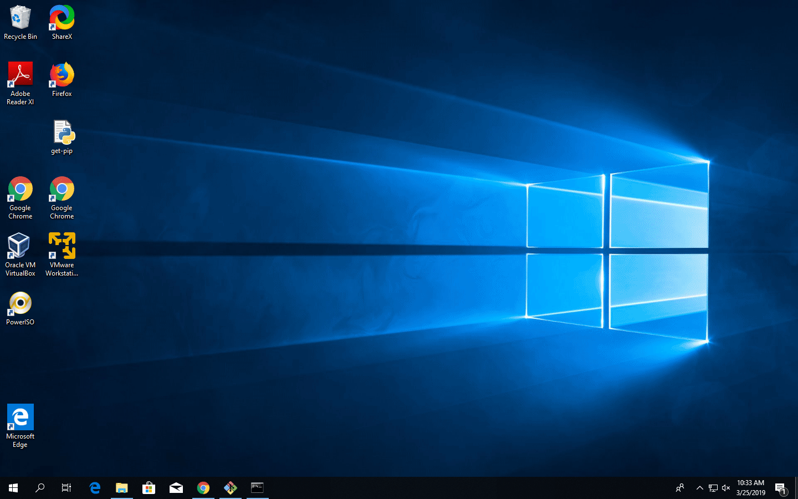
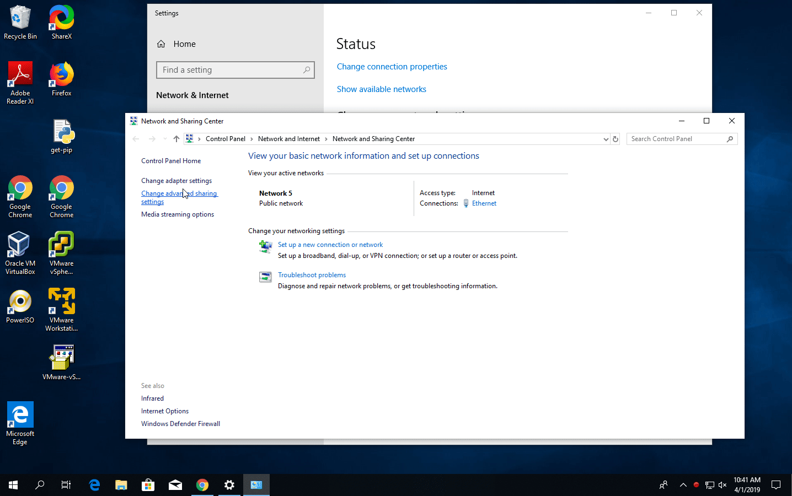

#Assigning your IP after Wiring
------------------

!!!note
	If you can not read the text, open the images in a new tab
1. Make your way to the network adapter settings in windows
	* 
	* **The IP's available for use are all IP's in the range 192.168.23.30-254**
	* The default gateway is: 192.168.23.1
	* Your IP should be: 192.168.23.*
	* Default Netmask: 255.255.255.0 
	* DNS should be: 8.8.8.8
2. Another option is to make an alternative configuration
	* **This configuration does not always work properly**
	* 