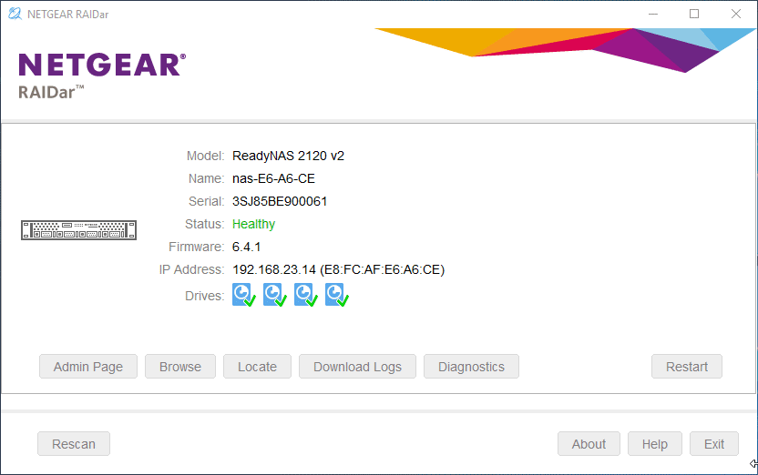

#Finding your NAS
---------------

!!! note
	This is a brief rundown on how to find and connect to the NAS
##Downloading Raidar

* First navigate to [the raidar download page](https://kb.netgear.com/20684/ReadyNAS-Downloads)
	* **Or** click the following [link](https://www.downloads.netgear.com/files/GDC/READYNAS-COMMON/RAIDar_6.5.0.exe)

##Finding the NAS

After you have discovered the NAS, you will see the IP Address of the NAS. To access the NAS Webpage, navigate to <a href="http://192.168.23.14" target="_blank">the NAS's IP</a>.

##Login Information

| Login | Password   |
|:-----:|:----------:|
| admin | Password01 |